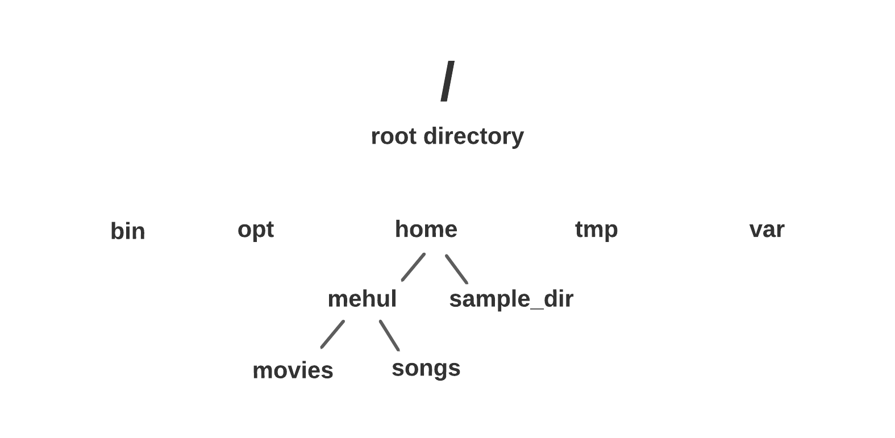

    
  

# Linux Operating System    
  
   
---
+ Open Source operating system.    
+ The source code is open to all developers and users, publicly visible and editable. 
+ Easy modification and redistribution.
+ The command line is case-sensetive.    
+ Debian, Fedora, Red Hat, and Ubuntiu are some of the common distributions of Linux.   

+ **What is a terminal?**    
A terminal is a program (text-based interface) used to interact with the computer system.      
  
+ When we open the terminal, by default we are in the home directory.
+ "|" pipe operator can be used for multiple commands in one line. 
---   

## Simple Commands    
**date** &nbsp; &nbsp; &nbsp; &nbsp; &nbsp; &nbsp; &nbsp; &nbsp; &nbsp; &nbsp; &nbsp; &nbsp; -> gives the current date and time    
**cal** &nbsp; &nbsp; &nbsp; &nbsp; &nbsp; &nbsp; &nbsp; &nbsp; &nbsp; &nbsp; &nbsp; &nbsp; -> calendar of the current month       
**cal -y** &nbsp; &nbsp; &nbsp; &nbsp; &nbsp; &nbsp; &nbsp; &nbsp; &nbsp; &nbsp; &nbsp; &nbsp; -> calendar of the current year (all of the 12 months)    
**cal 1999** &nbsp; &nbsp; &nbsp; &nbsp; &nbsp; &nbsp; &nbsp; &nbsp; &nbsp; &nbsp; &nbsp; &nbsp; -> gives the calendar for a particular year 1999 (specify the year)      
**cal 1 2021** &nbsp; &nbsp; &nbsp; &nbsp; &nbsp; &nbsp; &nbsp; &nbsp; &nbsp; &nbsp; &nbsp; &nbsp; -> calendar for January 2021 (1 = January, specify the month and the year)  
**cal -3** &nbsp; &nbsp; &nbsp; &nbsp; &nbsp; &nbsp; &nbsp; &nbsp; &nbsp; &nbsp; &nbsp; &nbsp; -> calendar for the previous, current and the next month (displays total 3 months)  
**clear** &nbsp; &nbsp; &nbsp; &nbsp; &nbsp; &nbsp; &nbsp; &nbsp; &nbsp; &nbsp; &nbsp; &nbsp;  -> clears the terminal (retains history)    
**exit** &nbsp; &nbsp; &nbsp; &nbsp; &nbsp; &nbsp; &nbsp; &nbsp; &nbsp; &nbsp; &nbsp; &nbsp;  -> exits the terminal (closes the terminal)    

   
## File System       

      

 File system is similar to any other operating system.    
 + Folders are called as directories, sub-folders as sub-directories.         
 + "." represents current directory.    
 + ".." represents parent directory or parent.     
 + Absolute Path: starts from the root directory to the destination directory (complete/full path).      
 + Relative Path: Starts with the current working directory and gives a path for a location relative to the current working directory. Never starts with "/" (root) directory.        
 + "~" represents home directory.
 + When we open the terminal, by default we are in the home directory.
 + "*" means multiple files.   

       
### *Commands*   
  
**pwd** &nbsp; &nbsp; &nbsp; &nbsp; &nbsp; &nbsp; &nbsp; &nbsp; &nbsp; &nbsp; &nbsp; &nbsp; -> Print working directory (absolute path)       
**ls** &nbsp; &nbsp; &nbsp; &nbsp; &nbsp; &nbsp; &nbsp; &nbsp; &nbsp; &nbsp; &nbsp; &nbsp; -> Lists all of the directories inside current working directory      
**cd Desktop** &nbsp; &nbsp; &nbsp; &nbsp; &nbsp; &nbsp; &nbsp; &nbsp; &nbsp; &nbsp; &nbsp; &nbsp;  &nbsp; &nbsp; &nbsp; &nbsp; &nbsp; &nbsp;    ->   ********     
**cd ./Desktop** &nbsp; &nbsp; &nbsp; &nbsp; &nbsp; &nbsp; &nbsp; &nbsp; &nbsp; &nbsp; &nbsp; &nbsp; &nbsp; &nbsp;  &nbsp; &nbsp; &nbsp; &nbsp; -> } cd = Change Directory. (takes to the desktop from the current directory) (all three commands doing the same thing - 3 different ways)      
**cd /home/mehul/Desktop** &nbsp; &nbsp; &nbsp; &nbsp; &nbsp; &nbsp; &nbsp; &nbsp;  &nbsp; &nbsp;    ->  ********    
**cd /** &nbsp; &nbsp; &nbsp; &nbsp; &nbsp; &nbsp; &nbsp; &nbsp; &nbsp; &nbsp; &nbsp; &nbsp; -> takes to the root directory   
cd ~ &nbsp; &nbsp; &nbsp; &nbsp; &nbsp; &nbsp; &nbsp; &nbsp; &nbsp; &nbsp; &nbsp; &nbsp;  -> takes to the home directory   
**cd ..** &nbsp; &nbsp; &nbsp; &nbsp; &nbsp; &nbsp; &nbsp; &nbsp; &nbsp; &nbsp; &nbsp; &nbsp;  -> takes to the parent directory - one step backwards      
**cd -** &nbsp; &nbsp; &nbsp; &nbsp; &nbsp; &nbsp; &nbsp; &nbsp; &nbsp; &nbsp; &nbsp; &nbsp;  -> takes to the previous directory      
**cd .** &nbsp; &nbsp; &nbsp; &nbsp; &nbsp; &nbsp; &nbsp; &nbsp; &nbsp; &nbsp; &nbsp; &nbsp;  -> It won't do anything. Because "." means current directory        
   
## INode & Links
  
+ INODES are links for every file
+ Like and index
+ It contains information
+ There are two types of  links in Linux: Soft link and Hard link.  
+ **Soft Link**    
    + Just like a shortcut in Windows.    
    + Pointer to the original file.
    + Inode is different from the original file.
    + Size is less than the original file.         
+ **Soft Link**    
    + Different name of the same file.
    + Copy of the original file.
    + Inode is same as the original file.
    + Size is same as the original file.        
   
## LS command options     
**ls /** &nbsp; &nbsp; &nbsp; &nbsp; &nbsp; &nbsp; &nbsp; &nbsp; &nbsp; &nbsp; &nbsp; &nbsp; -> gives the contents of the root directory  
ls ~ &nbsp; &nbsp; &nbsp; &nbsp; &nbsp; &nbsp; &nbsp; &nbsp; &nbsp; &nbsp; &nbsp; &nbsp; -> gives the contents of the home directory      
**ls ..** &nbsp; &nbsp; &nbsp; &nbsp; &nbsp; &nbsp; &nbsp; &nbsp; &nbsp; &nbsp; &nbsp; &nbsp; -> gives the contents of the parent directory        
**ls -** ❌ &nbsp; &nbsp; &nbsp; &nbsp; &nbsp; &nbsp; &nbsp; &nbsp; &nbsp; &nbsp; &nbsp; &nbsp; -> "-" which we used for previous directory doesn't work with ls.     
**ls /** &nbsp; &nbsp; &nbsp; &nbsp; &nbsp; &nbsp; &nbsp; &nbsp; &nbsp; &nbsp; &nbsp; &nbsp; -> gives the contents of the root directory      
**ls /** &nbsp; &nbsp; &nbsp; &nbsp; &nbsp; &nbsp; &nbsp; &nbsp; &nbsp; &nbsp; &nbsp; &nbsp; -> gives the contents of the root directory      
**ls /** &nbsp; &nbsp; &nbsp; &nbsp; &nbsp; &nbsp; &nbsp; &nbsp; &nbsp; &nbsp; &nbsp; &nbsp; -> gives the contents of the root directory      

         
         
    

  
