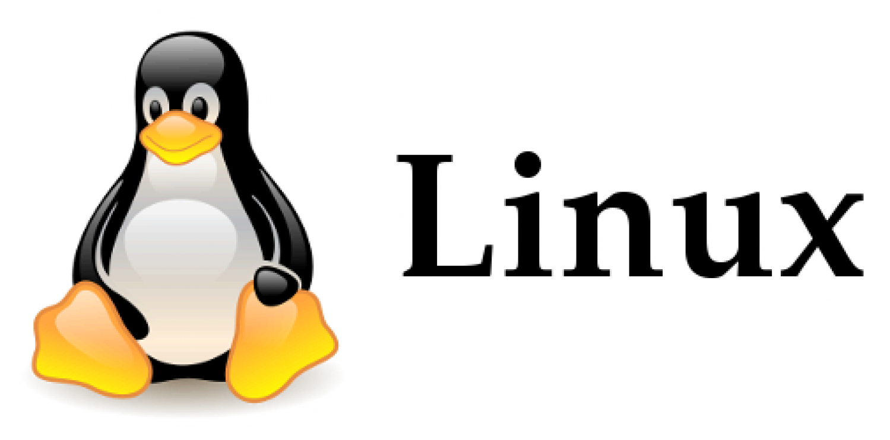

    
  

# Linux Operating System    
(I am creating this repository to keep notes for Linux commands. Go through the commands and try them in your Linux terminal for better understanding and to take a look at the outputs for each of the commands.)    
   
---
+ Open Source operating system.    
+ The source code is open to all developers and users, publicly visible and editable. 
+ Easy modification and redistribution.
+ The command line is case-sensetive.    

+ **What is a terminal?**    
A terminal is a program (text-based interface) used to interact with the computer system.      

---   

### Simple Commands    
$> date          -> gives the current date and time     
$> cal            -> calendar of the current month    
$> cal -y         -> calendar of the current year (all months) 
